# Software Dev Notes Part 1

[TOC]

## Module 1: Intro

*  **Software engineering** is the tools/processes we use to design, construct, maintain programs over time

* There's more to development to good code, there's no one right way to develop software

* Software should be comprehensible by humans, easily maintainable, and reusable

  * **Main challenge: controlling complexity**
  * readable, flexible, and modular

*  Two pieces of code are **coupled** if a change in one demands a change in the other.

  * alternatively called: connascence (meaning born together)
  * the more two pieces of code are coupled, the harder they are to understand and modify because you have to understand both to understand either of them

### General Purpose Principles

  1. **Use Good Names** 
     1. Replace magic numbers with good names
     2. Name data types accurately for what they do or will be used for
     3. Name functions/methods in terms of what they do
  2. **Design Your Data**
     1. Decide what part of the information in the real world needs to be represented as data
     2. Decide how that information needs to be represented as data
     3. Document how to interpret the data as info about the real world
        1. leave lots of comments i guess
  3. **One method/one job**
     1. You might want to test one part but not the other
     2. It's easier to test a method that does only one job
     3. You only have to change the method's 
     4. "Single Responsibility Principle"
  4. **Don't repeat yourself**
     1. If you have some quantity that you use more than once, give it a name and use the name. That way you only need to change it in one place
     2. If you have a task that you do in many places, make it into a procedure
     3. If the tasks are slightly different, turn the differences into parameters
     4. "Single Point of Control"
  5. **Don't hardcode things that are likely to change**
     1. Self-explanatory; ex) don't place the tax rate into the code, switch it to a variable

### Five Principles of OO Programming

  1. **Make Your Interfaces Meaningful**
     - interfaces are where we specify behaviors
        1.  behavior: what a single method does, such as returning a value or causing a mutation
        2. compiler only checks syntax, not behavior, so make sure the implementation of the interface behaves as expectedi
        3. **interface segregation**: if you have a class that needs to advertise two sets of behavior, have it implement two interfaces (one interface, one job)
  2. **Depend Only on Behaviors, Not Their Implementation**
     - **dependency inversion:** high level modules should not depend on low level modules, they should depend on abstractions aka behaviors.
     - **delegation**: using composition to avoid hard work. You delegate tasks to other "workers" or methods. you don't know how that method is implemented, just what it returns. 

  3. - **Keep Things as Private as You Can**
           1. You don't want people messing with your code, depending on details of your code, or breaking critical invariants
           2. **Encapsulation**
   4. **Favor Dynamic Dispatch over Conditionals**
        - Otherwise known as have different classes that implement an interface
        - Make codes more extensible, readable, and maintainable
               1. less editing in various pleases
        - **open-closed principle**: the idea that you can extend your system by adding code, rather than changing it. "open" for extension but "closed" for modification
        - OO organization is better when new data variants are more likely than new operations
   5. **Favor Interfaces over Subclassing**
        - An  interface specifies some of the behavior of the classes that implement it
        - A superclass specifies some of algorithms of the classes that inherit from it
        - Subclasses can see some of the details of your algorithm, which weakens encapsulation
               1. can violate invariants if properties are changed by the subclass
               2. 
## Module 2: Documenting Design/Design Patterns

* You and your teammates need to have a common understanding of things in your program
  * What are their names?
  * What do the represent?
  * How do they interact?
### CRC Cards
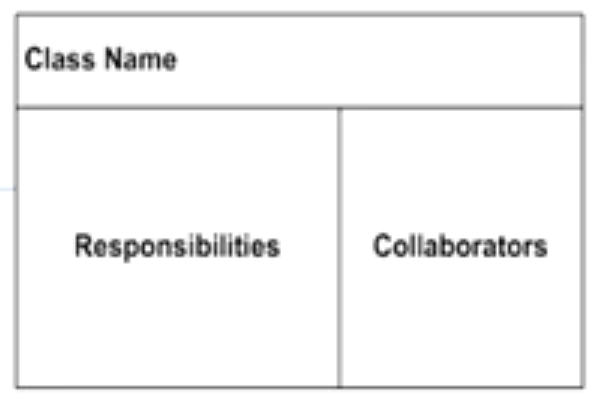

**Class**: 

* the name of the "thing" in your program. Could be a class/interface/type/etc

**Responsibilities**

* the main job of this thing in the program. Should be simple according to the single responsibility principle. 

**Collaborators**:
* other "things" with which thing class interacts
* the thing with which this class is coupled
* all things the class uses, all all the things that directly use this class

Cards can be moved and stacked and rearranged

### UML


* UML is a general purpose visual modeling language developed by an industry consortium in 1997

* Most common diagram: the Class Diagram

* **Class Diagram:** three part box containing

  * **class name** (required)
  * list of **attributes** with names and types (optional)
    * the members/instance variables/properties) whose values are either	
      * scalars ("simple" attributes)
      * arrays or lists of scalars ("multivalued scalars")
      * simple structs (ex: dates or names)
      * **Class members whose values are full-fledged objects or members of another class are usually represented as relationships**
  * list of **methods** with argument lists (optional)
  * classes with special roles may be annotated with stereotypes, which are written with `<<...>>`

* **Relationships**:

  * UML has notations for 3 types of relationships between classes

    * **Association** (most common)

      

      * An association is a simple semantic relationship between two objects that indicates a link or dependency between them

      * can be directed (meaning there is a relationship between one object to another), or bi-directional (meaning it works both ways)

      * Associations can be navigable, meaning that from one object you can find the associated object. it is notated with an arrow to indicate the direction in which it flows

      * An association with no arrows means its navigability is unspecificed

      * Associations also have **cardinality**. This tells us  whether the relationship is 1:1...2 or 1:1..N

        * 1:1 - one to one
        * 1:1...* at least one 
        * 1:0...1 at most one

        

        the solid triangle indicates how a human should interpret the relationship, it does not notate navigability 

      * Associations should express something about the real world

    * **Generalization**: 

      

      * grouping of entities based on common attributes

      * more general as you move up, more specific as you move down

      * more specific may inherit attributes/operations from the more general

        

      * In UML, `implements` is considered to be a form of generalization

        * interfaces are notated like a class with the stereotype `<<interface>>` alternatively, the name of the interface might be given in italics
        * the "implements" relationship may be notated with a dotted or dashed land, or by an open-headed arrow

    * **Aggregation**

      * A "has" relationship (i.e. A car has wheels)
      * Aggregation is an association that means a "whole/part" or "containment" relationship
      * if it's confusing, just say it's an association
      * shown by a diamond arrowhead next to the item that does the "having"

### Design Patterns

A design pattern is a piece of advice on how to design your code

**Elements of a pattern:**
* pattern name
* the problem (when to apply the pattern)
* the solution (describes the elements that make up the pattern)
* the consequences (the results and trade-offs of applying the pattern)

**Adapter Pattern**:
* Create a class that adapts the methods/properties of one class into the methods/properties of another
* example problem: 
  * you have a list but you need a stack
  * solution: create a class that ranslating a list to a stack by adding the stack related functions
  * Consequences: you now use the list as if it is a stack
* 

**Composite Pattern**:
* Allows you to represent tree-like data
* Example problem:
  * You have to represent different shapes, such as a square, a circle, or a triangle
  * solution: create a `Shape` interface and three implementations: `Square`, `Circle`, `Triangle`

#### Iterator Pattern

* use built-in iterators in typescript such as `map`, `forEach`, `reduce`
* or use a `for` loop to iterate through each item
* much of the complexity of the pattern has been absorbed into the coding language

#### Factory Pattern

* Create a class with a static method to get an instance of a particular class

#### Singleton Pattern

* Make the factory have a private construction, and instantiate a particular class only once
* have a static method in the factory to return the same instance of the class every time

#### Observer Pattern
* Use when you need to notify classes or objects that are "watching" changes to a particular object
* The object being observed (the "subject")  keeps a list of the watchers who need to be notified when something changes
* When a new object wants to subscribe to changes, it registers with the subject

#### Visitor Pattern
* Let's say you have a hierarchical structure, and many operations that will need to traverse it—but you don't know in advance what those operations will be. 
  * Each operation can be implemented imperatively, perhaps by accumulating the answer in some variable. 
  * You'd like to keep the internal organization of each node hidden from the operation
* Represent each operation as a class, with a method for each kind of node you have.
  * the class is called the `Visitor` class
* To invoke the operation, create a new object of the Visitor class (called the `visitor`, lowercase)
* Then send the visitor to the node
* The node calls back to the appropriate method of the visitor, then sends the visitor on to each of its children.

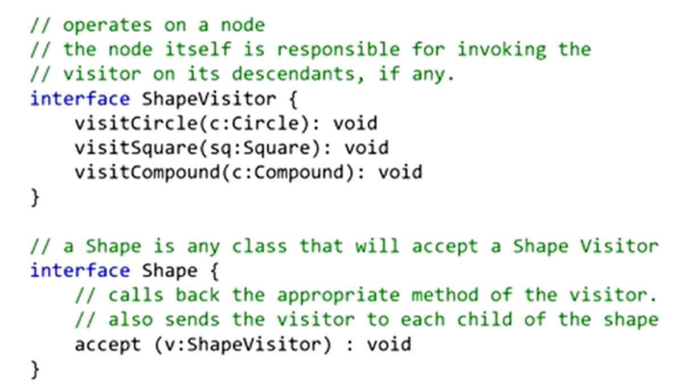


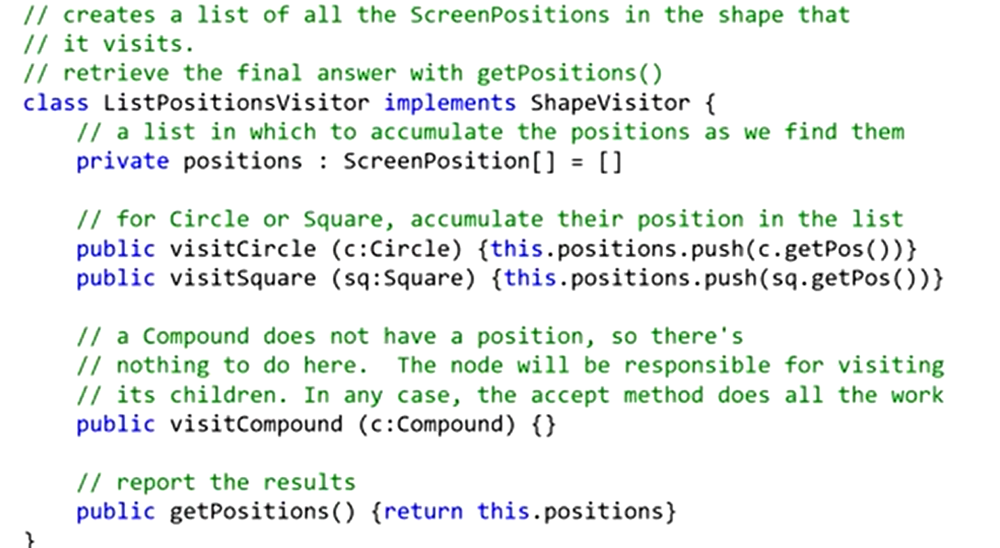

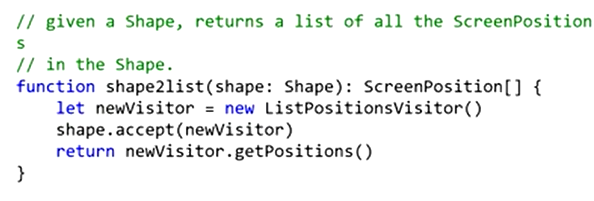

## Module 3: Software Architecture

### Different Architectures

* Goal: create a high-level model of the system
  * Abstract details away in reusable components
* There are different types  of top-level software organizations

#### Monolithic

* A single app, with no particular organization
* Ok for single-dev, short-lived projects

#### Layered


- Each layer depends on services from the layer or layers below
- Organize teams by layer, different layers require different expertise
- When layers are run on different pieces of hardware, they are sometimes called "tiers"
- Operating systems are layered
  - Layers communicate through procedure calls and callbacks (sometimes called "up-calls")

#### Pipeline

* divide tasks into stages
* good for straight-line processes such as image processing
* also good for visualizing hardware

#### Plugins

* System consists of a small core (the microkernel) for essential functions, and lots of hooks for adding other services
* Highly extensible
* Plug-ins can be designed by small less-experienced teams, even by users!
* Connection methods may vary
* VSCode is an example

#### Event-Driven Architecture

* Metaphor: a bunch of bureaucrats shuffling papers
* Each processing unit  has an inbox and one or more outboxes
* Each unit takes a task from its inbox, processes it, and puts in the results in one or more outboxes
* Stages are typically connected by async message queues
* the flow is conditional, meaning something only happens if a task is inboxed/outboxed

#### Microservices

* Overall task is divided into different components
* Each component is implemented independently
* Each component is independently replaceable, independently updatable
* Components can be built as libraries, but more usually as web services
* Advantages:
  * services may scale differently, so can be implemented on hardware appropriate for each (how much cpu, memory, disk, etc?)
  * services are independent, so can be developed and deployed independently
* Disadvantages:
  * service discovery - how do you find the services you need?
  * should services have organization, or all they all equals?
  * overall it's more complex
* they are highly scalable and trendy

### HTTP Protocol
* HTTP sands for HyperText Transfer Protocol

* HTTP is asymmetric, it distinguishes between client and server
  
  * the client initiates a request, the server replies by sending a response
  
* HTTP is stateless, each request/response pair is independent
  * If the client intends the request to be part of the session, then the request must include all the data needed to allow the server to resume the ession at that point
  * HTTP is stateless but not sessionless
  
* HTTP is an application level protocol

* Originally designed to transmit HTML data, but can be used to send anything

* HTTP is extensible

  * A request comes with **headers** which define the type of data the server is sending and wants back
  * A response comes with **headers** which indicates whether the request was successful or not and the format the data is transmitted
  * Headers may include other kinds of metadata

* Typical HTTP flow:

  * **Client opens a TCP connection.** This is the connection over which data will flow. Clients can create a fresh connection or reuse an existing one
* **Client sends a request**. Consists of:
  
  *  a method (one of a few simple verbs)
    * a path (a URL)
    * a version
    * headers
    * maybe a body
  * **Server interprets the request**
  * **Server sends a response**, which consists of:
    * a version
    * a status code
    * a status message
    * some headers
    * maybe a body

### REST Protocol

* We'd like a remote procedure call (RPC) - when you need a service, you'd like to call and immediately get things back
  * not possible
  * there can be transmission delays (**latency**)
  * can the client do something useful in the meantime? (**asynchrony**). this leads to complexity
  * client/server mismatches add more complexity
    * different languages, data representations, wire-transmission formats, etc
* This is solved by using **REST**!
* Representational State Transfer (REST) is a design philosophy
  * interfaces that follow REST principles are called RESTful

#### REST Principles

* **Single Server**
  * client doesn't worry about data, server doesn't worry about UI
  * server may pass request to other machines, but client doesn't know that
  * server should be a "single box" to the client
* **Stateless**
  * no session state in server, each client must contain all info that the server needs to process request
  * client doesn't have to write a sequence of requests to get what they need
* **Uniform Interface**
  * Associate URIs with resources
    * URIs should hierarchically identify nouns that describe resources that exist, not verbs
    * examples:
      * `/cities/losangeles`
      * `transcripts/00345/graduate`
    * bad example:
      * `/getCity/losangeles`
  * Actions (verbs) that can be taken with resources are specified by HTTP methods (see REST methods)
* **Uniform Cacheability**
  * requests must classify themselves as cacheable or not

#### REST Methods

* GET: requests the server tor respond representation of a resource
  * the path is the name of the resource
* POST: requests the server to create a resource
  * the path is the name of the resource
* PUT: requests the server to change of the value of the resource to the given value
* DELETE: requests the server to delete the resource

#### Parameters

There are three ways to associates parameters with a request:

* **path parameters**: `transcripts/00324/graduate` aka `transcripts/:studentid/:studentType`
* **query parameters**: `transcripts/graduate?lastname=covey&firstname=avery`
* **body parameters:** typically done only for POST/PUT requests. they are placed in the first line of the body

NOTE: I did not take notes on the demo of the `express.js` server, since this exam will not involve writing code

## Module 4: Javascript

* A javascript execution state consists of a bunch of event handlers

* An **event handler** is:

  * A piece of code that is waiting for some event to happen
  * In javascript, all event handlers work in the same address state, meaning that they can communicate through shared space. This also means that switching between handlers can be fast. 

* At any time, one event handler is running and the others are waiting

* Types of **events**:

  * some timer has reached a specific value
  * some input/output occurs
  * some other event handler(s) complete

* Javascript has "run-to-completion" semantics, meaning that it always runs to completion and is never interrupted

  * a handler does not have to worry about some other handler overwriting its memory
  * this also means that a high priority task (like responding to a keystroke) can't interrupt a lower priority task
  * this means you should organize your computation into many handlers, all of which run to completion quickly
  * **When the running event handler completes, the scheduler chooses one of the other ready event handlers to execute**

### Promises

* A promise is an object representing the eventual completion or failure of a handler

* A promise always in one of three states

  * pending
  * fulfilled/resolved, meaning that it completed successfully
  * rejected, meaning that the handler failed

* Once a promise is fulfilled or rejected, it stays that way

* A promise may have a `.then` property, which is a handler to be invoked when the promise is fulfilled. This ignores rejected promises

* A promise may also have a `.catch` property, which is a handler invoked when the promise is rejected. It ignores resolved promises

* `.then` and `.catch` blocks can succeed or fail

  * throwing an error counts as failure, anything else counts as succeeding

  * `.then` and `catch` can also throw errors to their successors. If you throw an error in the callback passed to the `.then` block, it can be caught by the `.catch` block

    
    ```aPromise.then(() => throw new Error("myError2")).catch((error) => {// should always run})```
    

* The following creates p2, a whole new promise the represents the result of promise p1 followed by the callback if p1 fulfills:

  ```const p2 = p1.then(callback);```

* p2 is ready when p1 is completed. When p2 is run, it refers to p1. If p1 was fulfilled, the value is passed to the callback, and p2 completes normally.

* If p1 is rejected, p2 exits with an unhandled error

* You can synchronize event handlers with `Promise.all[]`

#### Async/Await

You can avoid complicated `.then` `.catch` chains using `async` and `await`.

* Async functions are declared with the `async` keyword

  ```async () => {}```

* With an async function, you can call another promise function, and await its result:

  ```
  async () => {
    const val = await aPromise();
    return val  + 2;
  }
  ```

* you can also (optionally) use a typical try/catch to catch errors

  ```
  async () => {
    try {
      const val = await aPromise();
      return val  + 2;
    } catch (e) {
      console.log('error')
    }
  }
  ```

* an async function always returns a promise

* Because a promise is created, it is automatically thrown in the pool of handlers to be run when ready

* the async keyword tells the compiler to convert the code into a typical `.then` `.catch` block

### Web Clients

* you can use `await` to make sure client `API` calls complete in the order we want

  * we want to wait for requests to complete before performing computations on the returned data

  * In the example in class, we had one file `remoteService.ts` that provides HTTP methods

  
  
  * We also had `dataService.ts` which provides REST endpoints that a client can request from
  
  
  
  * axios did all the work in terms of actually creating the http requests
  
  
## Module 5: Testing

* Software Testing is the process of checking if software meets certain concrete requirements
* Testing is carried out by execution of the software
* **SUT** = System Under Test consists of:
  * Inputs
  * State
  * Outputs
  * State Change
  * (Other) Behavior
* A test for a SUT consists of 
  * Given [a certain state in the SUT]
  * When [certain inputs are presented]
  * Then [certain outputs, state change, and behavior are expected]
* Running a test
  * Construct the situation by setting up the SUT to get the state ready
  * Apply the operation inputs
  * Check the outputs, verify the state change, handle the behavior
* **Dijkstra's Law**
  * "Program testing can be used to show the presence of bugs, but never to show their absence"
  * The state space of a SUT is (usually) infinite, but testing can only infinite a finite number of tests
  * Even if the state space is finite, it may still be too large to make exhaustive testing feasible
* **What if the tests themselves are in error?**

### Classifying Tests

* we can classify tests according to several cross-cutting dimensions
  * Scope: What sort of thing is the SUT?
    * **Unit Tests**: the SUT is a single method/class/object
    * **Integration tests:** the SUT is a combination of units,  a subsystem
    * **System tests**: SUT is the whole system being developed
  * Purpose: What are we testing?
    * **Acceptance Test**: Customer level requirement testing. Tests whether we are building the right system
    * **Functional Test**: "Black box" testing, specification testing
    * **Structural Testing**: "White Box" testing,  exercising the code
    * **Regression Tests**: Prevents bugs from re-entering during maintenance
  * Size: What resources does testing need?
    * **Small**: run on a single process, no blocking input/output. these are fast to run and can be run automatically and frequently
    * **Medium**: run on a single machine, no network input/output (only localhost); hermetic; potentially slow;
    * **Large/enormous tests**: run on a network; potentially expensive
  * How: How is testing performed
    * **Automated Tests**: can be run without supervision, suitable for frequent automated runs
    * **Manual tests**: require a human to run and evaluate; tests may ill-defined and deterministic, like trying to "break" the system
    * **Customer-facing tests:** require an intermediary to evaluate and the customer to use the software
    
    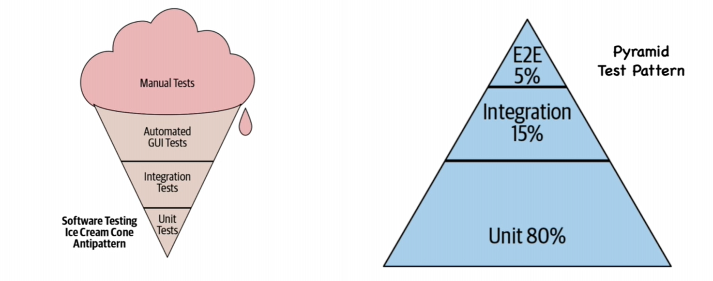

### Test-Driven Development

* Development is driven by "issues":
  * new feature requests
  * enhancement requests
  * bug reports
  * internal feature requests


#### Process
* TASK ONE: Write a test
  * the test should fail, a bug report is not actionable until we have replicated it
  * A feature request is not actionable until we know how it should work
  * Typically, the new feature will require multiple tests
* TASK TWO: Fix the code until the test passes
  * The fix should be the simplest possible that addresses the issue
* TASK THREE: Clean up the code
  * At leisure, refactor code. This is not driven by issues and should have no visible behavior changes, but all tests should pass

#### Strengths

* Goals are concrete and actionable
* We revisit requirements frequently, ensuring that we're building the right products, and that mistakes are fixed earlier
* Separate refactoring stage means code hygiene is not forgotten
* Robust test portfolio gives confidence in maintenance

#### Weaknesses

* Often the same person writes the test and implements the code being tested
  * Blind spot: programmer may overlook something
  * Gentleness: programmer might avoid "hard" tests
* Tests can add to maintenance problems if they are slow, flaky, or brittle
* May be too overly strict

#### Variants

* Acceptance Test Driven Development (ATDD)
  * Write "system" tests to express user requirements
  * May be slow or large
  * Some may not be automatable
* Behavior Test Driven Development (BTDD)
  * Uses structured natural language to describe user stories with desired behaviors
  * Also a "system" test

### Evaluating Tests

* Testing evaluates software systems. We need to ask two questions:
  * Validation: Are we building the right product?
  * Verification: Are we building the product right?
* How do we evaluate tests?
  * Purpose: Are tests checking the right things?
  * Adequacy: Are they checking things right? 
  
#### Functional Testing Adequacy

* Functional tests are proxies for a **specification**

  * A specification is a precise definition of all behavior of SUT (outputs, state mutation, other effects) in all situations (state and inputs)
  * A specification may be formal (mathematical), informal (natural language), or implicit ("I know it when I see it")
  * Adequacy of a test suite is probability that an implementation passing all the tests actually fulfills the specification
    * If a test contradicts the specification, then the suite including it has zero adequacy
  
##### **Coverage of Abstraction of SUT**

  * Find independently testable features (ITFs) and test these separately
  
  * Convert cartesian product of possibilities to sum
  
  * There is a danger that we could miss an interaction
  
  * Test "special values" such as boundary values, barely legal/barely illegal inputs
  
  * Test integer overflow
  
  * Other methods:
  
    * Abstract specification as a deterministic finite state automaton (DFA), then use *Structural Testing* over the abstraction
    * The danger here is that the model may be less complex than the system

#### Structural Testing Adequacy

1. Adequacy can be measured as percentages of goal:

  * Statement coverage
  * branch coverage
  * path coverage

2. Quantitative measurement is possible

3. We should break up a function in terms of blocks , then structure these blocks as a control flow graph and test every branch of the graph

4. There should be 100% block coverage, and 100% branch coverage

5. Sometimes a fault is only manifest on a particular path, but the number of paths can be infinite (like if there is a loop)

  * But there are ways to limit number of branches (wont be covered in this course)

  

  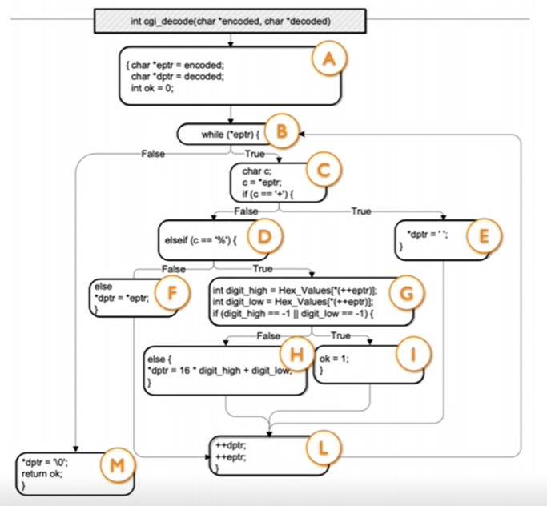

##### **Structural Test Criteria**

  1. Path coverage (usually impossible) 
  2. Repetition-Free path coverage
  3. Branch coverage
        4. Block coverage = Statement coverage


* 100% coverage may be impossible

##### **Mutation Testing**

* a form of structural testing where the code in the SUT is mutated (i.e. replacing && with ||), and then we check whether the test suite fails

* Mutation testing is more than coverage because it checks that the change made a difference

* Difficult in practice—there are too many possible mutants, and too many mutants are equivalent or uninteresting

#### Regression Test Adequacy

* Adequacy includes whether tests cover all uses:
  * uses may include unspecified behavior (for example, users may a assume that a hash result if non-negative)
  * **Hyrum's law**: any visible behavior may have dependents
* Users are responsible to add tests
  * **Beyonce Rule**: "If you liked it, you should have out a test on it"
##### **Not Useful (Bad) Tests**
  * **Flaky tests** are those that fail intermittently
    * could be due to nondeterminism (hash codes, random numbers) or timing issues
  * **Brittle tests** are those that fail when tests are changed
    * reordering tests could break brittle tests
  * **Mystery tests** aren't clear why they fail
    * how can the dev know what to fix?
##### **Test Smells**

Test smells name problem aspects of tests. Smelly tests are more likely to be bad.

* **Resource optimism**: assumes that certain external resources (such as a file to read/write to) can be used.

  * if assumption proves false, test becomes flaky

* **Conditional Test logic**: test code has conditionals/loops

  * test is hard to understand, and if it fails, we won't know what went wrong

* **Mystery Guest**: uses information unknown to the test; assumes context, which can change

  * Test will misbehave if reordered, therefore making it brittle

##### **What Makes Tests Good?**

* Tests should be **hermetic** (on a single machine)
* Tests should be clear
* Tests should be scoped as **small** as possible
* Test should make calls against **public** APIs

### Testing Systems

* Large systems are hard to test
  * they could have a database component where the contents need to reflect/simulate the real world, or data could be confidential
  * it may have network connections that could be slow/flaky/disrupted. The resources may also change
  * the environment may affect how the app behaves
  * human actors can be unpredictable
* Two Ways to Handle Difficulties
  * **Pay the cost, do the test**
    * A large test can reveal costs that smaller tests can't
  * **Automate with tools**
    * Use "test doubles" such as stubs, mocks/spies, and fakes
    * Do random testing ("fuzzing") against a reference implementation

 #### Test Stub

* Supply an object with the same interface / has same methods and default result values
* The stub allows the test to run. If it blindly uses the stub, it can proceed; if it expects something from the object, the test will likely fail
* But it does not:
  * Remember how the stub was used
  * Tell the stub what to do when it is called

 #### Test Spies

* remembers how the object was called, then the test harness can check what happened (`.toBeCalledWith`)
* A spy can be useful on the "real object", showing, for example, what was sent on a network, how many times something was logged, or what was inserted into a database
* Often used with a mock when it involves returning specific values

 #### Test Mocks

* has scripted results, meaning that if a particular method is called, it will return a particular value
* A complex mock may have many scripts (i.e. multiple methods, and different results for subsequent calls)
* Useful mocking assumes we know how the mock object will be used
* If a "mock" has real logic, it becomes a "fake"

 #### Test Fake

* A fake has an implementation of the object being replaced
  * a low-fidelity fake implements things partially, just enough to work for the test
  * a high-fidelity fake implements most aspects, usually all functional aspects but less efficient and scalable than the real thing
* the purpose of a fake is to avoid processes/network/cost
  * makes the test cheap and deterministic

 #### Random Input

* To replace a user, we can program a bot
  * randomly uses buttons, mouse, types arbitrary text
* Smarter "fuzzing" can capture real actions or make targeted mutations

 #### Weaknesses of Test Doubles

* Mock/Fake might not behave correctly
  * test harness might assume wrong behavior - this can be solved with a higher fidelity fake
* The SUT may use a different algorithm
  * the spies expect a particular usage of double'
  * The test is brittle because it depends too much on internal behavior of SUT

## Module 6: User-Centered Design

### Determining Requirements

A three-step process:

1. **Elicitation**: Discover requirements from prospective customers
2. **Analysis**: Understand and prioritize requirements elicited
3. **Validation**: bring back requirements to customer for confirmation

### Usability

* **Usability**: how a software impacts a human with particular goal
  * Five aspects of usability:
    * **Learnability**: How easy is it to learn to use the artifact to accomplish a goal
    * **Effectiveness**:  How often does the use lead to the completion of the goal:
    * **Productivity**: How large of multiplier of human effort does this artifact give? Does it make things easier or harder?
    * **Retainability**: How long is the ability to use the artifact retained between users?
    * **Satisfiability**: How pleasant is the artifact to use?

### User-Centered Design

* A system is evaluated from the user viewpoint

* A prototype of the product should be made and evaluated before development fully starts

  * **Paper prototypes:** hand drawn user interfaces where developers animate the paper to behave like an interface, and users say what they would do
  * **Wizard of oz prototype:** software looks correct, but is barely functional—uses scripted interaction only
  * **Working prototype**: fully realized user interface with limited functionality. Particularly good to get out feature request with a quick-and-dirty implementation, which will immediately allow devs to get feedback
    * In TDD: feature request is realized in a test
    * In UCD: feature request is realized in a user interface

### Forms of User Evaluation

* **Empirical evaluation**: "how many tasks accomplished in n minutes"
* **Qualitative evaluation**: observers find patterns in interaction, and users give feedback after use
* **"Dogfooding"**: developers use product as soon as feasible, otherwise known as internal evaluation
* **Heuristic evaluation**: evaluate against best practices, involves a small team of evaluators to evaluate an interface based on recognized usability principles
  * Heuristics = rules of thumb
  * usually cheaper than rounding up real users

#### Heuristics

* Does the interface:

  * *H1: Make System Status Visible*
    * remind the user of where they are, what they've inputted?
    * say what it is currently doing?
    * give the results of its processing?
    * give feedback in response to user action? 
  * *H2: Match Between System and Real World*
    * speak the users' language?
    * follow real world conventions?
    * avoid internal jargon? (like error messages the user would not understand)
    * hide options that can't be interacted with?
  * *H3:  Ensure User Control and Freedom*
    * provide "exits" for mistaken choices, such as undo, redo, and cancel?
    * avoid forcing users down fixed paths?
  * *H4: Provide Consistency and Standards*
    * use the same words/situations/actions in all similar situations?
    * have text that is consistent with figures? 
    * persist similarities between similar things and persist differences between different things?
  * *H5: Prevent Errors*
    * design inputs and other user actions to anticipate/avoid error?
  * *H6: Rely on Recognition Rather Than Recall*
    * make objects/actions/options easily retrievable?
    * rely on picking from a set of options rather than typing something out from memory?
  * *H7: Provide Flexibility and Efficiency of Use*
    * allow accelerators for experts, such as gestures and keyboard shortcuts?
    * allow users to tailor frequent actions, such as macros?
  * *H8: Maintain aesthetic and minimalist design*
    * remove irrelevant or rarely needed info
  * *H9: Help users recognize, diagnose, and recover from errors*
    * use standards to convey errors?
    * display errors in languages that users understand?
    * precisely indicate the problem?
    * constructively suggest a solution?
  * *H10: Provide Help and Documentation*
    * provide help that is easy to search?
    * provide help that is focused on the user's task?
    * provide concrete steps to carry out?
    * provide help that is always available?

  ### React
  **[I am skipping this part because I feel as though I know it, and it's unlikely to appear on the test]**


## Module 7: Debugging/Git

* When a bug is reported, log it in a tracking system so that you don't lose track of it
  * connect to symptoms, tests, causes and fixes
  * make sure the tracking system is searchable to ensure that there's no duplicates
* After logging:
  * Assign a priority—how crucial is it to fix this?
  * Assign a responsible party—who will work on it?
  * Try to find a Short Self-Contained Correct Example
    * S: remove everything that is not necessary
    * S-C: add everything needed to demonstrate the problem
    * C: the example is valid
    * E: a concrete example of bug behavior
* Assignee tasks:
  * the assignee needs to investigate the report to see if it is actionable, or else it is:
    * Invalid: not relevant
    * Duplicate: already reported
    * Fixed: in a recent version
    * Can't reproduce: back to reporter for more data
  * Otherwise, if bug is reproducible:
    * Complete SSCCE if not already down
    * Convert SSCCE into a failing test
* Debugging has two phases:
  * **Diagnosis**:
    * Determine the fault causing the problem observed
  * **Correction**:
    * Correct the fault so the test passes and none fail
* Anti-Pattern: Mutation Debugging
  * Make sure to diagnose a problem—don't just make changes and re-run tests until they all pass
* **Synchronic** **Fault Location:** the fault must lie between program start and the failure point. use tools such as the debugger and console logs to find where it's breaking. A form of binary search.
* **Diachronic Fault Location**: If the fault was not present in an earlier version, we can find when it was introduced by searching through the commits to see where things start breaking
  * use `git bisect` to determine which commit fails an automated test
* **Hypothesis Testing**:
  * Guessing diagnosis based on experience (pattern matching), community (colleagues, stackoverflow), or information from a faulty run
  * Verbalize the hypothesis
  * Test the hypothesis
* Debugging tools:
  * print statements
  * special purpose code changes
  * breakpoints
  * stepping
  * watchpoints
* Assist future debugging
  * check invariants frequently during testing
  * "fail fast" as soon as a problem is noticed

### Git 
[I am not going to outline this, we should both know it]

## Module 8: Code Improvement

### Static Program Analysis
* Program analysis that is done without running the program
* Alternative to testing
* Testing can only test finite, concrete cases --> We want to test unbounded, symbolic cases

* Solution is **Program Verification**: Checks code against specification
  * Caveats: Can only show absence of bugs, not presence. A verification failing doesn't mean there's a bug.
  * Sometimes we cannot show either
  * Time and $$$ is an issue

* **Specification**: Precisely defines exactly the behavior a system should have
  * A "full formal specification" is essentially a program
  * Must be modular --> Without it, it'll be incomprehensible and unprovable
  * Must be maintained with code

* We want to find something between **Verification** and **Testing**: Bug finding!
  * Partial verification: will find only some bugs
  * Optional type systems
  * Linters
  * Quadrant of bug detection: False positive, true positive, true negative, false negative (these are exactly what you would expect) --> reducing false negatives often increases false positives, and vice-versa

* Criteria for good automated program analyis
  * Efficient and easy (shouldn't require whole program analysis)
  * Rarely spurious (no more than 10% effectively false positive: i.e. a false positive that will cause a developer to act on it)
  * Actionable (should point out easy-to-fix issues)
  * Effective (problems are actually important)

### Code Smells and Refactoring

* Code smells: aka anti-patterns
  * Common and known: each smell has [a name and a recommended fix](https://refactoring.guru/refactoring/smells) 
  * Data class: class has public properties and few if any methods
  * Duplicated code (...self explanatory)
  * Too many parameters: A method has too many params

* Refactoring: Code is reorganized
  * Code's behavior is not changed: "topology preserving transformation"
  * Reversible 
  * Remove smells, improve code flexibility
  * Can break code if done wrong: regression tests can help prevent this

* Technical debt: sum of internal problems in your project code base
  * NOT user-visible failures: code smells, missing tests, missing docs, out-of-date dependencies, etc
  * Creates "interest" that is paid during maintenance 
  * Good reasons to go into tech debt: Time-sensative stuff --> prototyping, fixing crit failure, getting product out the door
  * Set aside time for tech debt

## Module 9: Distributed systems and security

### What is a distributed system?
* Can do two things:
  * Many servers talking through a network, and client isn't aware
  * Many servers talking through a network, and client IS aware

* Goals of distributed system:
  * Scalability
  * Performance
  * Latency
  * Availability: measured as uptime / (uptime + downtime)
  * Fault Tolerance --> How do we handle failing disks, power outages, etc?

* Challenges:
  * More machines, more chances of failure
  * Number of nodes + distance between them --> lowers performance and increases latency

* 8 fallacies of distributed computing (things that are not true): 1-7 are due to physical properties of networks
  1. The network is reliable
  2. Latency is zero
  3. Bandwith is infinite
  4. The network is secure 
  5. Typology doesn't change
  6. Transport cost is zero
  7. The network is homogenous
  8. There is one administrator

* Should we make our software distributed?
  * Do we need to store more data than one computer can store?
  * Do we need to process requests faster than one computer can?
  * Are we willing and able to take on additional complications?

### Strategies for building distributed systems
* Recurring solutions:
  * Partitioning
  
  * Replication
  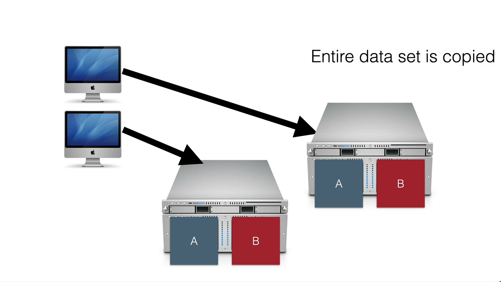
  * Particioning and Replication
  

* Major issue with replication: consistency. How do we propogate updates across servers? 
  * Server told to set value to "5" must tell all other servers to also set value to "5." Only when this is successful will the server update the value, thus ensuring sequential consistency...problem, this is not very fault tolerant.
  * Fault tolerant solution: If the replica doesn't update, assume that it's offline, and update anyway...problem, what if it's the *network* that isn't working, and the replica isn't actually offline? Will break sequential consistency if a client can interact with the replica.
  * Basically: We have a problem because two machines in a distributed system do not have a *shared fate.* This is called the "split brain" issue.
  * **CAP Theorem:** You must pick two of three.
    * Consistency: All nodes see same data at same time
    * Availability: Individual node failures do not prevent survivors from operating
    * Partition tolerance: The network still works as expected if some nodes can't communicate
    * Realistically, we want to decide between Consistency and Availability, depending on which one is more important
  * Byzantine failures: A replica sends back an "OK, I updated!" message when it didn't actually update

### Software Engineering and Security Threats

* CIA Properties
  * Confidentiality: Is info disclosed to unauthorized individuals?
  * Integrity: Is code or data tampered with?
  * Availability: Is the system accessible and usable?

* Threat: Potential event that could compromise security property
* Attack: Realization of a threat
* Vulnerability: Characteristic or flaw that, if exploited, could result in a compromise

* Threat models:
  * What are we defending?
  * What kinds of malicious actors exist and what might they try?
  * Who do we trust? --> Gotta trust SOMEONE (not remote users)

* Things we can do to protect ourselves:
  * Important security code (authentication, for example) should go in the backend
  * Frontend shouldn't trust blindly that answer came from backend, and vice-versa (man-in-the-middle attacks) --> We can avoid this problem with SSL/encryption.

* Some more complicated issues:
  * Problem with SSL: Certificate Authorities (CA)  validate all websites (i.e. they will tell you that you are genuinely talking to Amazon) which create a "chain of trust" --> VERY BAD NEWS if CAs are compromised 
  * Another nasty attack vector: Dependencies/third-party vendors. Attacker can put malware in dependencies (ESLint in 2018)
  * Security rabbithole...

### Engineering Secure Software

* [OWASP Top Security Risks](https://owasp.org/www-project-top-ten)

* Code injection
  * Attacker is able to insert code as unsanitized data that could run...
    * In our database (SQL injection)
    * In our client (XSS) 
    * Within the server (malformed requests that get processed --> See 2017 Equifax security breach)
  * Fix: 
    * Always sanitize our input. 
    * Use tools like LGTM to detect vulnerable data flows
    * Use middleware that side-steps the problem (e.g. return data as JSON, data gets put in React component)

* Broken authentication + access control
  * Fix:
    * Implement multi-factor auth
    * Implement weak-password checks
    * Apply per-record access control
    * Harden password reset pathways
    * Rely on a trusted component instead of building auth yourself (auth0)
    * DO NOT hard-code credentials EVER (e.g. DO NOT PUT API KEYS IN YOUR CODE) --> Automated checkers for this such as GitGuardian

* Weakly protected sensitive data
  * Fix
    * Classify data by sensitivity and give sensitive data extra protection
    * Encrypt sensitive data - in transit/at rest
    * Make plan for data controls, stick to it
    * Can we avoid storing sensitive data all together? I.e. do we need to store people's CC numbers? Can we just use Square or Paypal?

* Using components with known vulnerabilities
  * PAY ATTENTION TO DEPENDABOT UPDATES
  * Problem: updating dependencies sometimes takes a lot of time/work, might not be necessary if the vulnerability is in a part of the dependency that isn't actually used in your code (i.e. a function that you never touch). Still, should always audit and make sure.

## Module 10: Continuous Development


### Software processes and continuous development
* Software proess: A structured set of activities required to develop a software product, goal of minimizing risks
  * Specification
  * Design/implementation
  * Validation
  * Evolution

* Verification and validation: quality assurance
  * We want to create feedback loops to detect more bugs sooner
  * Make sure that our software does everything it should do

* We want to make sure that our software can evolve and change
  * Note: Most software built on top of large/old codebases...99% of proprietary software uses some open source software

* Software Processes
  * Code-and-fix: really bad, really common. Build software and modify until customer satisfied.
    * No means of assessing progress, difficult to coordinate multiple programmers
    * Useful for "hacking" together small/individual projects
    
  
  * Waterfall model: Breaks software dev process into those four phases and explicitly builds in QA
    * Experience applying steps in past projects can be used to estimate duration of "similar steps"
    * Produces software artifacts that can be re-used
    * Difficult accomodating change after process is underway: Must complete one phase before moving on to next
    
  
  * Agile model: Iterative model, where each iteration is several weeks long and results in several features being built
    * "Sprint model": Each sprint is a cycle of the model
    * Know that requirements always evolve
    * Can get useful feedback from partial apps
     

* Common goal: "Shift left" --> Find defects earlier in the software dev process, will cost less to fix
* Continuous development: Like agile, but with fast feedback loop. Makes finding bugs faster, "shifts left"
  * Formal mechanism for deploying and validating new code (test/staging/prod)
  * Unblocks developers and increases velocity --> Less downtime for dev
  

### Continuous integration 
* Testing the right things at the right time: giving developers feedback on their changes
* Continuously assemble and test our entire codebase. Automate build/test chunk of the feedback loop
* Build systems: Automatically compile code and generate executables
  * Make, mave, gradle, etc.
  * Makes builds repeatable, reproducible, and standard
  * Not just compilation. In parallel (as much as possible) we'd like to...
    * Fetch and link dependencies
    * Provision and teardown for integration testing
    * Run tests
    * Generate release archive
* Things to consider:
  * Pre-commit tests: Should we run small subset of tests before integrating changes?
  * Do we test new changes one-by-one if multiple integrations are coming in? How do we manage a change queue?
  * Do we run every test on every integration?
  * Do we use mocks?

* Small scale CI: Run everything on everything
  
* Medium scale: Run different tests on different branches
  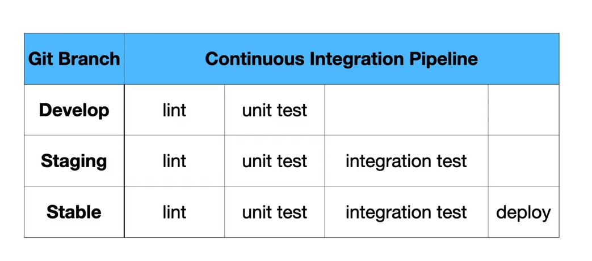
* Large scale CI (Google):
  * Pre-submit optimization: run fast tests for each individual change
  * Run all affected tests on a batch of commits; "build cop" monitors and acts immediately to roll-back or fix

### Deployment Infranstructure
* Back in the old days --> Manual deployment to private or shared machines. Copy files over, reset server.
  * Does not scale at all...not to number of machines, number of programs, size of programs, or frequency of deployments
* Make it slightly better...automate the file copying, monitor for anomalies
  * Doesn't solve the problem of resource consumption: if more people use it, it needs more resources. But if no one usees it, don't need the resources. We don't want to have just one low-resource program running on the machine, so we deploy multiple programs (multitenacy). Problem...if one suddenly becomes popular, it can starve other programs out. 

* Modern solutions:
  * Things to consider:
    * Centralization vs customization --> if we want really specific config, Heroku might not be the best choice
    * How do we manage state?
    * What is our expected scale?
    * How much management do we want to do?
  * Better multi-tenacy: virtualization! Each app gets its own VM
    * Problem: each VM runs its own OS, not efficient use of resources
    * Greatest degree of control, greatest cost, greatest latency
  * Containerization: Docker. Lightweight containers, run on host machine OS, so less resources
    * Better resource utilization than VMs
  * Kubernetes: Will create Docker containers for different programs, will scale up or down if needed
    * Gives you multi-tenacy and load-balancing, yay!
  * You might not have an infra person...can we pay a service to make it work for you?
    * Yep! Heroku, Netlify, etc. Pay per second that our code is up.
    * Put a simple config file in our Git repo and Heroku handles load balancer in Amazon EC2 VM and bills us for how long we have our server up
    * Similarly, Netlify distributes our frontend through their CDN, handles fault-tolerance for us, bills us
    * Minimal degree of control, YMMV with cost
  * Functions-as-a-services: We just have a few functions called infrequently, don't wanna pay for a VM/service to have them up constantly
    * Can pay serverless provider to run a function when request, bill per millesecond when functions run
    * AWS Lambda, Google Cloud Functions, etc.
    * Can't store data
    * Minimal degree of control, least latency, YMMV with cost

### Continuous Delivery
* How do we fix defects in the prod environment (or just before they make it in?)
* Basic idea: "If stuff blows up, we want it to affect the least amount of people"
* Release frequently, in small batches
* Easier to detect specific impact and isolate quickly, rollback if buggy
* If release can go out quickly/automatically, we can release multiple times a day!
* Evaluate business impacts of new features by A/B testing:
   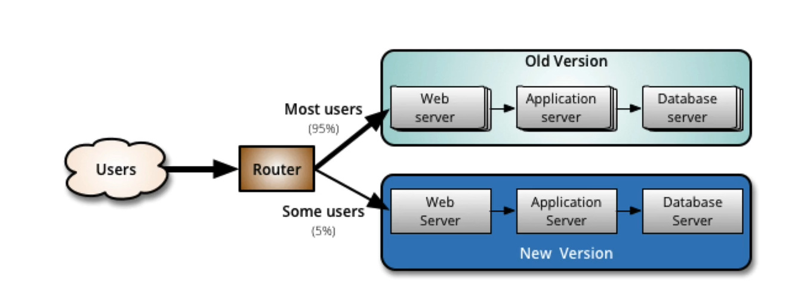
* Key aspect: Staging environments
  * Deploy to a complete production-like environment with no users
  * Can direct focus group to staging environment --> Either our own engineers or alpha/beta testers
  * Lower risk than prod
  * Go from dev env --> staging env --> prod env, with Q/A at each phase
* DevOps
  * Someone needs to monitor software post-deploy
  * Whose job is it?
  * Key tenant of DevOps: The people who make the changes own them from cradle to grave, regardless of platform (desktop, mobile, etc)
  
* Note: Does not mean that all changes will be released as soon as they're made --> need to go through release pipeline first
* Large organizations: Release engineer decides when something is "ready to go," oversees deployment
* Monitoring: Track production (and staging) metrics
  * Hardware (temperatures, fan speeds...)
  * OS (memory usage, CPU load...)
  * Middleware (Memory, thread/db connection pools...)
  * Applications (Business transactions, conversion rates...)

## Module 11: Engineering Equitable Software

### Engineering Equitable Software
* Power imbalance between software engineers and users
* More complicated than "don't be evil" 
* Examples:
  * Algorithmic Bias: COMPAS Sentencing Tool --> Recidivism rate prediction
    * White defendants had a higher false negative rate (labeled lower risk, did re-offend) and Black defendants had a higher false positive rate
    * White defendants were given lower recidivism scores in general
    * Algorithmic bias often due to hidden correlations
  * Algorithmic Bias: Price Discrimination (the thing we were talking about the other day -- location based correlating to socioeconomic status)
  * Climate impact: Machine Learning model training and development can have HUGE levels of CO2 emission
  * Incusivity and Accessibility: Domonio's Pizza 
    * Sued for not being accessible to the blind, argued that the ADA applied to physical locations only
    * Supreme Court said "yes it does"
  * Evading regulation: Volkswagen
    * Volkswagen had customized software that reduced emissions when taking emissions test
    * Misled both regulators and consumers
  * Can be easy to make unequitable software -- but we should do the work

### Ethics in Software Engineering
* Professional ethics: Standards established for divinity, law, medicine, and engineering, among others. These professions are required to go through specific ethical training
* Case study: Citi building engineering failure
  * Failure discovered that could cause the building to fall over if a strong enough wind struck it from a particular direction
  * Was fixed quickly, but in secret, without informing the public
  * Was this the right thing to do?
* Case study: Therac-25
  * Bug in radiation machine failure caused at least 6 deaths and unknown injuries/disease
  * Bug was undiscovered for 2 years
  * Weak accountability in manufacturer's organization --> no testing plan, no code review, no safety checks
  * Resulted in stronger checks in safety critical (ESPECIALLY medical) software
* Code of Ethics: Not legally held to a code of ethics
  * ACM has established a code of ethics for Software Engineers
  * However, study found that simply exposing developers to ACM Code did not result in more ethical decision making 
* Ethical decisions are hard decisions
  * Example: Interactive AI systems can be useful, but can amplify hate. Do we continue to make them?
* Accessibility should *not* be a hard decision
  * i.e. Domino's should have absolutely made their software screenreader accessible
  * Not that difficult, saves you a PR nightmare...and blind people buy pizza
* Value Sensitive Design: Consider how software impacts users' universal values
  * Human rights
  * Accessibility
  * Justice
  * Privacy
  * Human welfare
* Unpacking "publlic interest"
  * What are the implications of failures?
  * Who will use the software, and how will they differ from each other?
  * How will my software impact those who don't use it?
  * Will the software amplify negative behavior for users and society at large?
  * On the flipside, will our software do good?


### Acceptance and Inclusivity Testing
* Bias is the default: we are not our users and we bring our own biases
  * Having diversity on the dev team is a great first step...but most dev teams do not reflect reality
  * Example: Non-diverse dev team at Google led to a photo-tagging feature that labled photos of Black people as gorillas
* People differ in a lot of cognitive ways as well: 
  * Motivations
  * Information processing stle
  * Computer self-efficacy
  * Risk averseness
  * Tech learning style
  * "Covering different facets will result in covering different genders" (so yeah, their thesis is basically women and men think differently ha)
* GenderMag: "discount usability evaluation"
  * Persona-based evaluation, basically step through an application pretending to be someone else
* Curb-cut effect: Making things more inclusive benefits everyone!
  * Curb-cuts benefit elderly, parents with strollers, etc.
* Usability testing: Directly measure the usability of inclusivity of our software by having real users perform tasks
  * Consider a diverse set of users
  * He suggests doing this after GenderMag shit to "validate problems (and fixes)" identified in cognitive walkthroughs
  * Evaluating accessbility: Have disabled users go through your website
  * Can do live user studies with A/B testing --> We should be ethical about the types of studies we design
    * Can assign people at random or test a specific demographic

## Module 12: Estimation and Productivity

### Planning Software Projects
* The tern "software engineering" was created at NATO conference to fix the "software crisis" -- software was terrible because there was no method/theory for how to build software
* Problems with software estimations
  * Projects are very different with each other
  * Different problems come up with each project
* Gantt Charts: Before you even start designing the software, plan things!
  * Come up with design and implementation tasks, identify dependencies between these tasks, estimate how long each task will take = estimation for whole project
  * Problem with this approach: Very difficult to scale --> The "mythical man-month," you can't estimate how long a project will take based on "man hours" because it's often not partitionable, adding more people means adding more communication, etc.
  * Other problem: You'll have no idea how long an individual task will take (especially if you haven't *designed* it yet)
* Agile Methodology and Planning
  * Break project into sprints
  * Each fixed-length sprint is planned independently
  * Planning might be a guess at first, but it gets better over time
  * Backlog --> Big projects broken down into bite-sized chunks
  * Two ways to estimate during planning meetings:
    * Planning poker: Teams play cards with numbers with the number of hours they think will be required, the team as a whole then looks at the numbers, discuss, and come to a consensus (I've used this before, it's fun!)
    * Story Points: Coarser, relative size of scope of each task (small, medium, large, etc.)
  * How many communication links (number of pairs on the team) are on your team? Makes work harder, grows exponentially with team size
    * Non-agile teams: One for frontend, one for backend, one for database, all very large
    * Agile teams: Cross-cutting different parts of the stack, feature-based, small (5-9 people).
  * Delivering on a deadline: need experience to estimate --> no silver bullet to determine how long a project will take
  
### Metrics in Software Engineering
* Sprint velocity = story points completed / story points planned --> Are we staying on track and are our estimations good?
* Lines of code (in general, per developer)
  * Useless on its own, sometimes useful if looking at change over time
* Code quality: Bugs open/closed, tests passing/failing
* McCabe Cyclometric Complexity: Analyze complexity of method based on control flow 
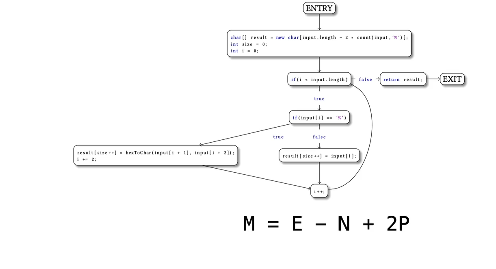
  * Edges - Nodes + 2 * Connected Components (he does not say what "connected components", but this graph has 1)
* How rigidly do we follow quantitative metrics?
  * More lines of code are not better
  * Not finding bugs is not necessarily a good thing (you could just be ignoring them)
  * McCabe metric doesn't really measure if the code is harder to read --> no correlation between cyclomatic complexity and errors/programmer comprehension/etc.
* We should be very skeptical of applying metrics against our code, and we should *especially* be skeptical of evaluating people based on metrics
  * McNamara fallacy: focus only on quantitative, easy-to-measure metrics and end up optimizing for the wrong thing
  * People will just change their behaviors to meet those metrics (at the cost of being good developers)
  * Extrinsic rewards are in general not a good strategy

### Strategies for Successful Software Teams
* Teams are important --> Don't fall for the starry-eyed portrayal of "the rock-star engineer"
* Three pillars of social skills (I cannot believe we are getting an actual class on this, wow, they really have no faith in CS majors)
  * Humility
  * Respect
  * Trust
* Don't be an asshole in code review ("Man, you totally got that wrong")
* Knowledge sharing is also important: it needs to scale linearly (or sub-linearly) with org growth
  * Mentorship
  * Q&A
  * Mailing lists
  * Tech talks
  * Documentation
* Bus Factor --> How many members of your team are irreplaceable? 
* Failures are inevitable: in software, humans, and processes
  * The important thing is to learn from them
  * Post-mortems should happen after failures
    * What went well?
    * What went wrong?
    * Where did we get lucky? 
    * How do we prevent it from happening again?
    * BAD APPROACH: Name, blame, and shame --> engineers are less likely to come forth with details about a failure, meaning that root causes are not being addressed
    * GOOD APPROACH: Blameless post-mortem. No pre-conceived notion of who's at fault, even if it *really looks like* someone's fault, no blaming anyone. 

### Measuring Engineering Productivity
* Needs to be *some* way to measure improvement --> improving productivity is the whole point of software engineering
* Common approach in research: analyze open-source projects
  * Do some languages have more errors than others?
  * Problem: lots of confounding variables
* Use both quantitative and qualitative metrics
* Don't use metrics to incentivize behavior (hopefully then people won't change their behavior)
* Google case study: Does having readability reviewers help or hurt productivity?
  * Goal/Signal/Metric framework.
    * Goal: Desired end result 
    * Signal: What we'd like to measure, but we can't
    * Metric: A proxy for a signal, which can actually be measured
  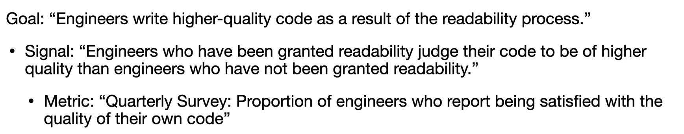
* QUANTS components of engineering productivity
  * Wuality of the code
  * Attention from engineers
  * Intellectual complexity
  * Tempo and velocity
  * Satisfaction